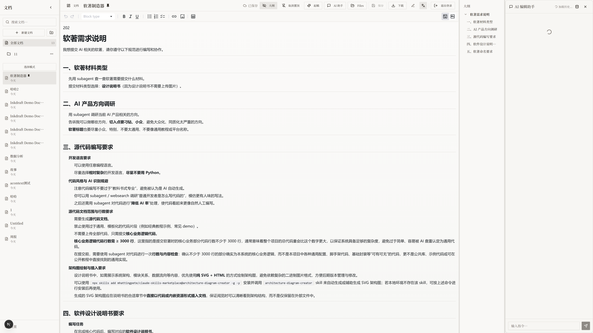
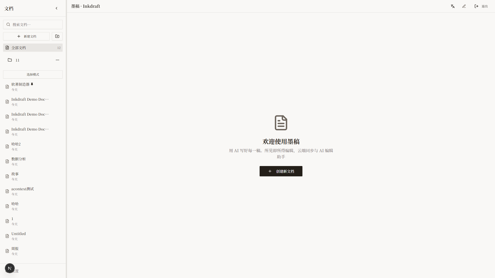
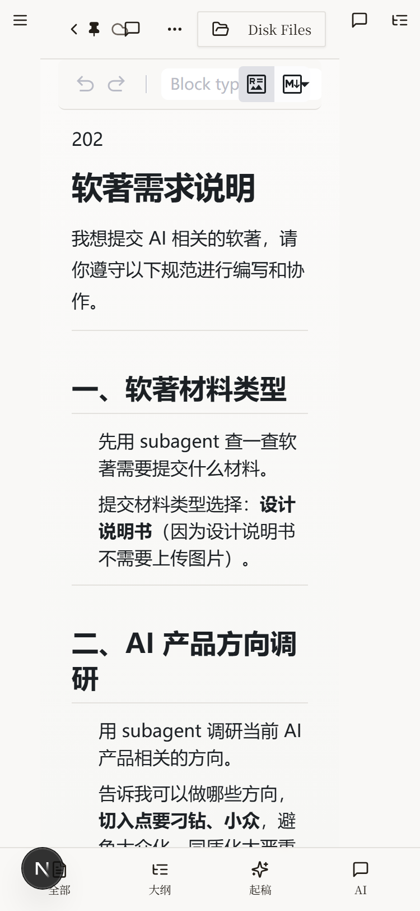

# Inkdraft

一款**支持 AI Agent 可控的 Markdown 编辑器**，让「写文档 + 写代码 + 跑分析」在一处优雅完成。

[English](README.md) | 中文文档

## 截图预览

| 编辑器 + AI 对话 | 文档列表 | 移动端 |
|:---:|:---:|:---:|
|  |  |  |

## 为什么选择 Inkdraft？

传统编辑器把 AI 当作建议工具。Inkdraft 更进一步 —— **AI Agent 可以直接修改你的文档**，而不只是提供建议。

### Agent 直接"动手改文档"

这款产品的最大特点是：应用本身就接入了 Agent，Agent 不再只是给出修改建议，而是可以直接对文档内容进行：

| 操作 | Agent 能做什么 |
|------|---------------|
| **增** | 补充段落、生成示例、自动续写内容 |
| **删** | 删除冗余内容、批量清理格式问题 |
| **改** | 润色文案、重写段落、改写风格 |
| **查** | 在长文档中快速检索、总结、对比信息 |

对用户来说，就是可以在一个编辑器里，边写边让 Agent 帮你「真正动手改文档」，而不是一段一段复制到别的窗口去处理。

### 内置 Acontext SDK：一边写文档、一边跑代码

编辑器内置了 [Acontext SDK](https://github.com/mbt1909432/acontext)，提供安全的代码执行沙箱等核心能力。用户可以在编辑器里直接：

- **运行 Python 代码** 做数据处理与分析
- **把分析结果**（图表、表格、结论）直接回写到当前文档
- **用代码辅助生成报告**，而不是手动搬运结果

整个过程都在同一个界面里完成，无需在本地环境、Notebook、BI 工具之间来回切换。

### 从传统 App 到真正的 Agent App

这款应用已经不再是传统意义上的"App"，而是通过对接 LLM 的文本与工具类核心 API，将其升级成了一款真正的 **Agent App**：

**内部 Agent：**
- 直接面向真实用户使用
- 负责文档编辑、数据分析、内容生成等任务
- 更像是「嵌在编辑器里的协作伙伴」

**外部 API 能力：**
- 对外暴露标准 API 接口
- 方便其他 Agent（例如 Claude Code、OpenAI 系列 Agent 等）作为"调用方"接入
- 第三方 Agent 可以对文档进行润色、生成内容，并把结果自动写回编辑器中

## 核心功能

### 富文本 Markdown 编辑

- **双模式编辑** - 在富文本（所见即所得）和源码模式之间无缝切换
- **实时大纲** - 自动生成文档目录结构，点击即可跳转
- **智能格式化** - 工具栏支持快速文本格式化（加粗、斜体、下划线、删除线、代码、标题）
- **选中文本工具栏** - 选中文本时自动显示上下文工具栏，支持快速格式化或 AI 操作
- **代码块** - 支持多种编程语言的语法高亮
- **表格与列表** - 完整支持表格、有序和无序列表
- **自动保存** - 每 30 秒自动同步到云端，支持手动 Ctrl+S 保存
- **同步状态** - 可视化显示云端同步状态（已同步、同步中、离线）

### AI Agent 能力

- **AI 对话面板** - 专门的对话界面，内置 Agent
  - 询问关于文档的问题
  - 获取写作建议和改进意见
  - 支持多轮对话，具有上下文记忆功能
- **直接操作文档** - Agent 可以增删改文档内容
- **AI 起稿** - 根据标题和说明生成完整的文档草稿
- **文本选中美化** - 选中任意文本后可以：
  - **润色** - 改善写作风格和清晰度
  - **扩写** - 添加更多细节和阐述
  - **缩写** - 总结并缩短内容
  - **修正语法** - 纠正语法和拼写错误
  - **自定义** - 提供您自己的指令
- **上下文记忆** - Agent 记住之前的对话，提供连贯的辅助
- **代码执行** - 通过 Acontext SDK 运行 Python 代码，将结果插入文档

### 文档管理

- **文件夹组织** - 创建文件夹来组织文档
- **文档置顶** - 将重要文档固定在顶部
- **快速重命名** - 直接从侧边栏重命名文档
- **批量操作** - 选择多个文档进行批量删除
- **搜索与筛选** - 按标题快速查找文档
- **导入 Markdown** - 导入现有 .md 文件，自动检测格式

### 导出选项

- **复制 Markdown** - 一键复制整个文档到剪贴板
- **下载 .md 文件** - 导出为 Markdown 文件
- **导出 Word** - 生成格式正确的 .docx 文件
- **导出 PDF** - 创建保留样式的 PDF

### 外部 Agent API

Inkdraft 对外暴露 RESTful API，供外部 Agent 接入：

- **认证方式** - 基于 API Key，支持配置过期时间
- **文档 CRUD** - 完整的增删改查操作
- **llms.txt** - 在 `/llms.txt` 提供 LLM 友好的 API 文档

```bash
# 示例：外部 Agent 创建文档
curl -X POST https://your-instance/api/external/documents \
  -H "Authorization: Bearer YOUR_API_KEY" \
  -H "Content-Type: application/json" \
  -d '{"title": "新文档", "content": "# 你好\n\n由 Agent 创建"}'
```

### 用户体验

- **响应式设计** - 在桌面和移动设备上完全可用
- **深色/浅色主题** - 自动跟随系统偏好或手动切换
- **多语言** - 界面支持中文和英文
- **可调整面板** - 拖拽调整侧边栏、大纲和聊天面板的大小
- **键盘快捷键** - Ctrl+S 保存，标准编辑快捷键

## 技术栈

| 类别 | 技术 |
|------|------|
| 框架 | Next.js 15 (App Router) |
| UI 组件 | shadcn/ui + Tailwind CSS |
| 编辑器 | MDXEditor + CodeMirror |
| 状态管理 | Zustand |
| 后端 | Supabase (Auth + Database + Realtime) |
| AI 集成 | OpenAI / Anthropic / Google Gemini |
| 代码执行 | Acontext SDK |

## 适合谁？

这款编辑器特别适合：

- **技术文档写作者** - 频繁编写技术文档、产品文档、方案文档的团队
- **数据分析师** - 需要在「代码—结论—报告」之间频繁切换的同学
- **Agent 开发者** - 想要把自己的 Agent 能力接入到一个可视化编辑器里的开发者

如果你也在折腾 AI Agent、数据分析或者知识管理工具，希望这款编辑器能给你一些灵感，也欢迎一起交流！

## 快速开始

### 环境要求

- Node.js 18+
- npm / yarn / pnpm
- Supabase 账号

### 安装步骤

1. 克隆项目

```bash
git clone https://github.com/mbt1909432/Inkdraft.git
cd Inkdraft
```

2. 安装依赖

```bash
npm install
```

3. 配置环境变量

复制 `.env.example` 到 `.env.local`：

```env
NEXT_PUBLIC_SUPABASE_URL=你的Supabase项目URL
NEXT_PUBLIC_SUPABASE_PUBLISHABLE_KEY=你的Supabase公钥
```

4. 启动开发服务器

```bash
npm run dev
```

访问 http://localhost:3000

## 可用命令

```bash
npm run dev      # 启动开发服务器
npm run build    # 生产构建
npm run start    # 启动生产服务器
npm run lint     # 运行 ESLint
```

## E2E 测试

测试使用 Playwright，运行在 3005 端口：

```bash
npm run dev -- -p 3005    # 在 3005 端口启动开发服务器
npx playwright test       # 运行 E2E 测试
```

## 项目结构

```
├── app/                    # Next.js App Router
│   ├── document/[id]/      # 文档编辑页面
│   ├── documents/          # 文档列表页面
│   ├── settings/           # 设置页面 (API Keys)
│   ├── api/
│   │   ├── external/       # 外部 Agent API 端点
│   │   ├── ai/             # AI 相关端点
│   │   └── draft/          # 起稿生成
│   └── llms.txt/           # LLM 友好的 API 文档
├── components/
│   ├── editor/             # 编辑器组件
│   ├── chat/               # AI 聊天 + Agent 界面
│   ├── sidebar/            # 侧边栏组件
│   └── ui/                 # shadcn/ui 组件
├── lib/
│   ├── store/              # Zustand 状态管理
│   ├── supabase/           # Supabase 客户端配置
│   └── export/             # 导出工具
└── contexts/               # React 上下文 (i18n)
```

## API 文档

访问 `/llms.txt` 获取 LLM 友好的 API 文档，包括：

- 通过 API Key 认证
- 文档 CRUD 端点：
  - `GET /api/external/documents` - 列出所有文档
  - `POST /api/external/documents` - 创建文档
  - `GET /api/external/documents/[id]` - 获取单个文档
  - `PUT /api/external/documents/[id]` - 更新文档
  - `DELETE /api/external/documents/[id]` - 删除文档

## 贡献

欢迎贡献！请随时提交 Pull Request。

## 许可证

MIT
