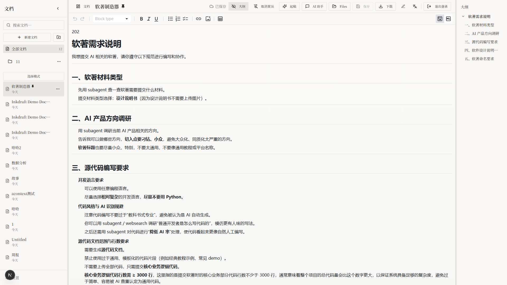

# Editor - Markdown Editor

The editor is the core of Inkdraft, featuring dual-mode editing, live outline, smart formatting, and more.

## Dual Mode Editing

### Rich Text Mode (Default)
- WYSIWYG editing experience
- Support for common Markdown formats (bold, italic, headings, lists, etc.)
- Quick formatting via toolbar buttons

### Source Mode
- Click the `</>` button in toolbar to toggle
- Edit raw Markdown directly
- Syntax highlighting for code blocks
- Press `Tab` to insert spaces

## Live Outline

The right panel shows an auto-generated table of contents:
- Click any heading to jump to that section
- Updates in real-time as you edit
- Collapse/expand with the panel toggle

## Smart Formatting

### Toolbar Actions

| Button | Action | Shortcut |
|--------|--------|----------|
| B | Bold | Ctrl+B |
| I | Italic | Ctrl+I |
| U | Underline | Ctrl+U |
| S | Strikethrough | — |
| Code | Inline code | — |
| Link | Insert link | Ctrl+K |
| H1-H6 | Headings | — |

### Selection Toolbar

When you select text, a context toolbar appears:
- **Format** - Bold, italic, underline, strikethrough, code
- **AI Actions** - Polish, expand, condense, fix grammar

## Auto Save

- Documents save automatically to the cloud every 30 seconds
- Manual save: Ctrl+S or click the save button
- Save status is displayed in real-time:
  - ☁️ Cloud icon = Synced
  - ⏳ Spinner = Saving
  - ☁️‍🚫 Cloud with slash = Offline

## Sync Status

The toolbar shows cloud sync status:
- **Synced** - Document saved to cloud, normal cloud icon
- **Syncing** - Uploading, spinner animation
- **Offline** - Network disconnected, cloud with slash icon
